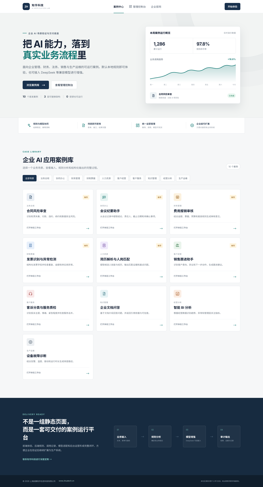
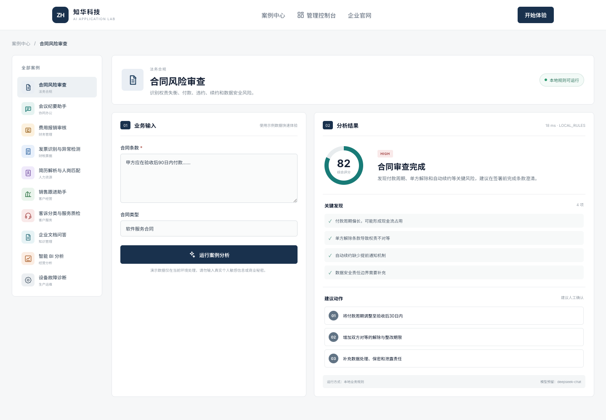
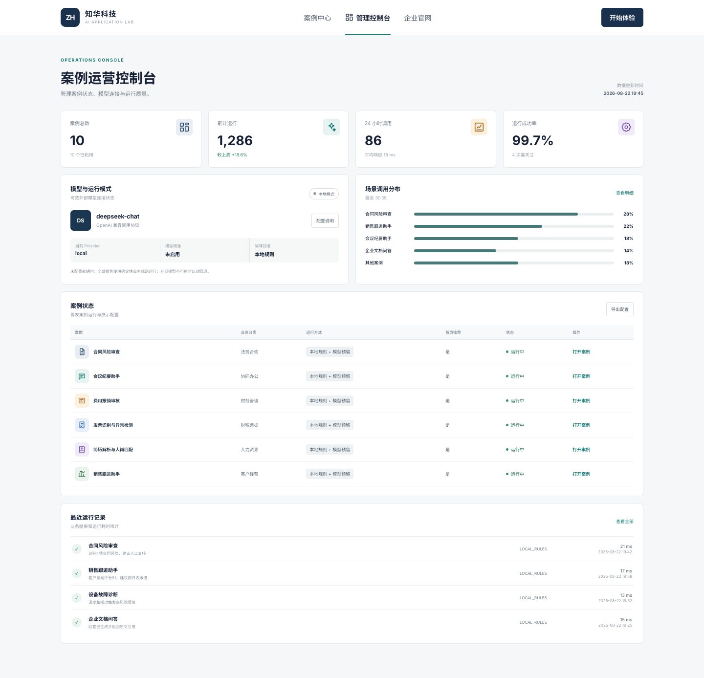

# ZhuaTech AI Cases｜知华科技企业 AI 应用案例中心

> 把抽象的模型能力转化为可体验、可测试、可扩展的企业业务案例。

[知华科技官网](https://www.zhuatech.cn/) · [33 个独立项目矩阵](docs/independent-project-matrix.md) · [架构设计](docs/architecture.md) · [API 摘要](docs/api.md) · [部署说明](deploy/README.md)

ZhuaTech AI Cases 是上海如静知华信息科技有限公司推出的企业 AI 场景案例平台社区源码版。项目包含案例门户、案例体验工作台、运营管理端、Java 业务规则运行时、MySQL 调用记录，以及可选的 DeepSeek/OpenAI 兼容模型适配层。

默认配置不调用任何外部模型，10 个案例均可通过本地确定性规则直接运行。使用者可根据自身数据安全要求自行配置模型服务。



## 首发案例地图

| 业务领域 | 案例 | 核心输出 |
| --- | --- | --- |
| 法务合规 | 合同风险审查 | 风险分、问题条款、整改动作 |
| 协同办公 | 会议纪要助手 | 会议结论、责任人、行动事项 |
| 财务管理 | 费用报销审核 | 预算检查、票据检查、审核意见 |
| 财税票据 | 发票识别与异常检测 | 结构化字段、金额异常、复核建议 |
| 人力资源 | 简历解析与人岗匹配 | 技能命中、能力缺口、面试问题 |
| 客户经营 | 销售跟进助手 | 意向评分、客户异议、下一步动作 |
| 客户服务 | 客诉分类与服务质检 | 投诉分类、优先级、话术问题 |
| 知识管理 | 企业文档问答 | 文档回答、引用依据、可信度 |
| 经营分析 | 智能 BI 分析 | 指标趋势、异常点、经营建议 |
| 生产运维 | 设备故障诊断 | 风险等级、可能原因、排查路径 |

## 一个案例如何运行

```text
业务输入 → 字段校验 → 本地业务规则 → 可选模型增强 → 结构化结果 → 调用审计
```

- **无密钥可运行**：核心判断由可测试的 Java 规则完成。
- **模型可插拔**：兼容 DeepSeek 及其他 OpenAI Chat Completions 协议服务。
- **失败可回退**：模型超时或不可用时自动返回本地分析结果。
- **结果有证据**：统一输出评分、发现、行动建议和结构化字段。
- **管理可观测**：运营端展示案例状态、运行量、运行方式和耗时。



## 案例运营管理端

管理控制台用于查看案例运行状态、模型连接状态、场景调用分布、案例启停配置和最近执行记录。社区版公开管理接口方便学习演示，生产部署前必须增加统一认证、权限、审计和限流。



## 技术基线

| 层级 | 技术方案 |
| --- | --- |
| Web | Vue 3、Vue Router、Axios、Vite，响应式 H5 |
| API | Java 21、Spring Boot 4、Validation、RestClient |
| 数据 | MySQL 8、Spring Data JPA、Flyway；测试使用 H2 |
| AI 接入 | DeepSeek / OpenAI 兼容 Chat Completions 协议 |
| Java 包名 | `cn.zhuatech.aicases` |
| 部署 | Docker、Docker Compose、Nginx |

## 本地体验

只运行前端演示，不需要数据库和模型密钥：

```bash
cd frontend
npm install
npm run dev:demo
```

浏览器访问 `http://localhost:5173`。演示模式内置了 10 个案例的专业示例数据和结果。

完整环境：

```bash
cp .env.example .env
docker compose up --build
```

访问地址：

- 案例门户：`http://localhost:8088`
- 后端接口：`http://localhost:8080/api`

## 自行配置 DeepSeek

`.env.example` 只包含空白占位符，不包含真实凭据：

```dotenv
ZHUATECH_AI_PROVIDER=deepseek
ZHUATECH_AI_BASE_URL=https://api.deepseek.com
ZHUATECH_AI_MODEL=deepseek-chat
ZHUATECH_AI_API_KEY=
```

填写使用者自己的 API Key 后重启后端即可。也可以将 `ZHUATECH_AI_BASE_URL` 和模型名替换为其他兼容服务。请勿把 `.env`、密钥、客户文档或数据库备份提交到代码仓库。

## 新增一个案例

1. 在后端 `CaseCatalog` 添加案例元数据和输入字段。
2. 在 `CaseExecutionService` 添加独立规则处理器。
3. 在前端 `cases.js` 添加字段定义和演示结果。
4. 为案例补充接口测试、边界测试与数据安全说明。
5. 如需外部模型，只让模型增强解释，不覆盖规则计算出的关键业务数值。

## 原创与知识产权说明

本项目围绕通用企业管理与人工智能应用场景独立设计和开发。代码、界面、产品文案和截图均为知华科技版本，不复制第三方网站的源码、图片、视频、商标或专有素材。

## 使用许可与商业服务

本工程仅限个人学习、研究和非商业技术交流，**不得商用**。企业内部部署、生产使用、SaaS、项目交付、收费培训、品牌替换或商业再分发，均须事先获得上海如静知华信息科技有限公司书面授权，详见 [LICENSE](LICENSE)。

企业 AI 转型、DeepSeek 接入、知识库、智能体、私有化部署、软件外包、软件项目外包、软件实施、FDE 外包和深度定制，请访问[知华科技官网](https://www.zhuatech.cn/)或扫码咨询。

| 微信咨询一 | 微信咨询二 |
| --- | --- |
|  |  |

## 搜索关键词

企业 AI 案例、DeepSeek 企业应用、AI 应用案例源码、Java AI 项目、Vue AI 平台、AI 合同审查、AI 会议纪要、AI 费用审核、AI 发票识别、AI 简历解析、AI 销售助手、AI 客服质检、企业 ChatPDF、智能 BI、AI 设备诊断、企业 AI 转型、知华科技、上海如静知华信息科技有限公司。
